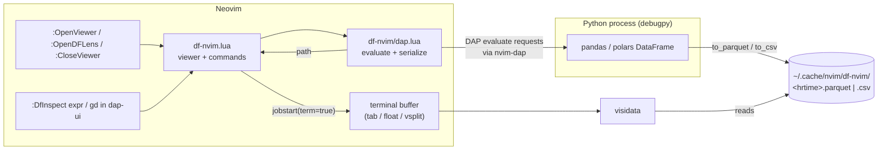
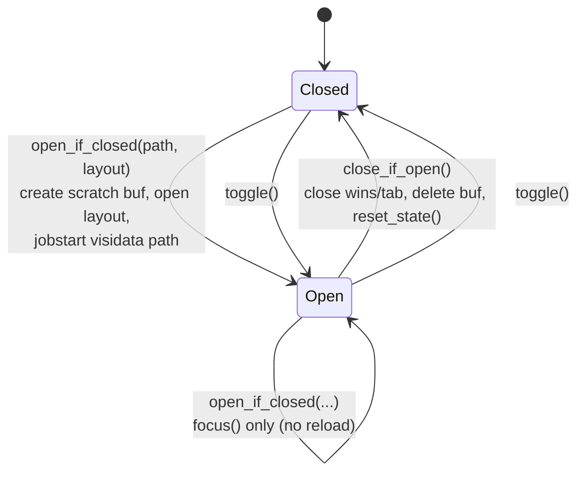
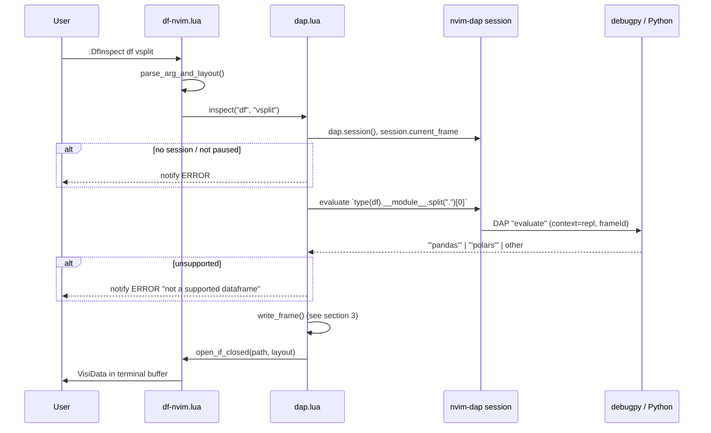
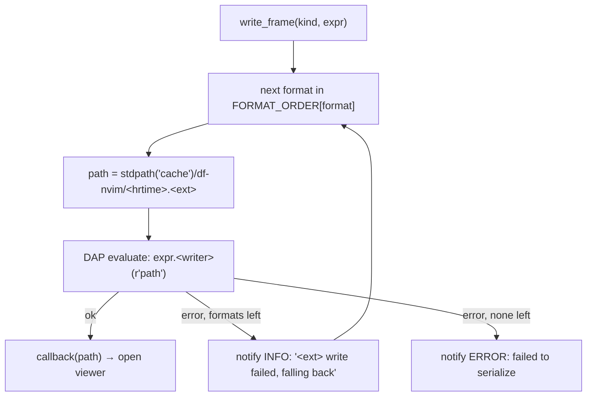
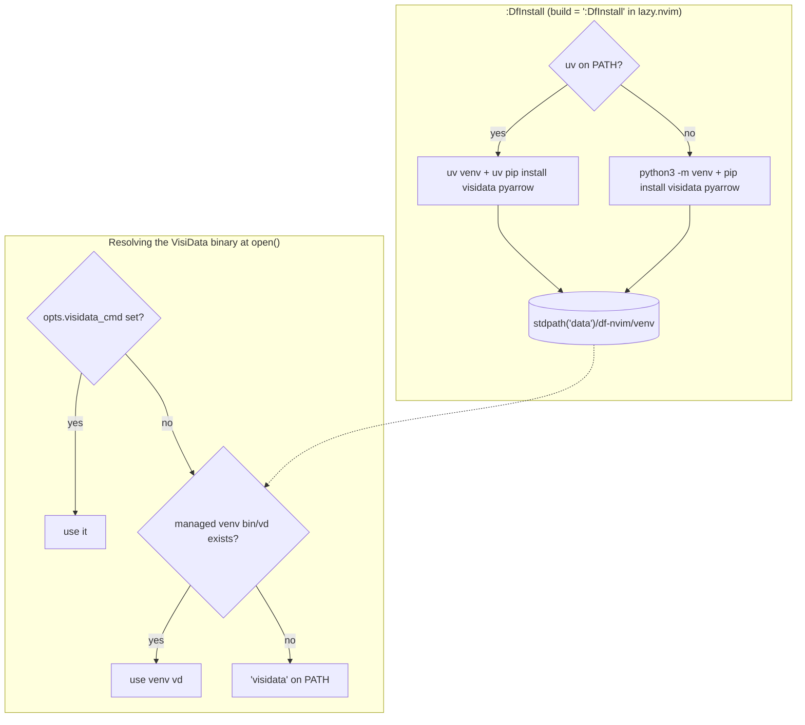

# df-nvim Architecture

df-nvim is a Neovim take on VS Code's Data Wrangler. It shows tabular data in
[VisiData](https://www.visidata.org/) running inside a Neovim terminal buffer.
You can also inspect live pandas/polars dataframes from a paused Python debug
session (nvim-dap + debugpy).

Status legend: ✅ implemented · 🗓️ planned

## Overview



## Modules

| File | Responsibility |
|---|---|
| `lua/df-nvim.lua` | Viewer lifecycle (open/focus/close/toggle), layout handling, argument parsing, user commands, keymaps, `setup()` |
| `lua/df-nvim/dap.lua` | Talks to the active nvim-dap session: detects the dataframe library, writes the frame to a temp file (format fallback), then hands the path back to the viewer |
| `lua/df-nvim/install.lua` 🗓️ | `:DfInstall`: creates a managed venv with VisiData + pyarrow |
| `lua/df-nvim/health.lua` 🗓️ | `:checkhealth df-nvim` |

## 1. Viewer core ✅

`df-nvim.lua` keeps a single viewer instance in `M.state`
(`buf`, `win`, `tab`, `layout`, `job`).



- **Layouts:** `tab` (default) uses `nvim_open_tabpage`. `float` is a centered
  window at 80% of the editor size with a rounded border. `vsplit` uses
  `:vsplit`.
- **"Is open" check:** the buffer must be valid, plus the tab (for the `tab`
  layout) or the window (for the others).
- **Launching VisiData:** `vim.fn.jobstart({ "visidata", filepath }, { term = true })`.
  VisiData chooses its loader from the file extension.

### Commands and argument parsing

| Command | Behavior |
|---|---|
| `:OpenViewer <path> [layout]` | Opens the file in VisiData |
| `:OpenDFLens` / `<leader>hw` | Toggles a fixed test file (`/tmp/dflens_test.csv`) |
| `:CloseViewer` | Closes the viewer |

`parse_arg_and_layout(raw)` takes the raw, unsplit argument string, so paths
containing spaces still work:

1. If the argument starts with a quote (`"…"` or `'…'`), the quoted part is the
   value and any trailing word is checked against `tab | float | vsplit`.
2. Otherwise, if the last whitespace-separated word is a layout keyword, it is
   split off. Everything before it is the value.
3. If no layout is given, it defaults to `tab`.

## 2. Debug session inspection ✅

Registered only when `opts.dap ~= false` and `require("dap")` succeeds at
`setup()` time.

- `:DfInspect <python expr> [layout]`: evaluates any Python expression in the
  paused frame.
- `gd` (configurable with `dap_inspect_keymap`) in the `dapui_scopes` and
  `dapui_watches` buffers: reads the variable name from the current line and
  inspects it. Only registered when nvim-dap-ui is installed.



## 3. Serialization format and fallback ✅

The `format` option is set in `setup()` and stored in
`require("df-nvim.dap").config.format`. An invalid value shows a warning and
resets to `auto`.

| `format` | Tries, in order |
|---|---|
| `auto` (default) | parquet, then csv |
| `parquet` | parquet only |
| `csv` | csv only |

Writers for each library:

| | pandas | polars |
|---|---|---|
| parquet | `to_parquet` | `write_parquet` |
| csv | `to_csv` | `write_csv` |



Why use parquet: it keeps dtypes (datetimes, categoricals, nullable ints) and
is faster and smaller than CSV.

Why keep the CSV fallback: in the debuggee, parquet writes fail when:

- `pyarrow` is missing in the debuggee's environment (pandas only; polars
  writes parquet natively)
- columns have non-string names (e.g. after a `pivot` or `DataFrame(ndarray)`)
- `object` columns hold mixed types, or the frame has MultiIndex columns

### debugpy setup (user side)

nvim-dap needs a debugpy adapter, most easily through nvim-dap-python:

```lua
require("dap-python").setup(vim.fn.expand("~/.virtualenvs/debugpy/bin/python"))
require("df-nvim").setup({ format = "auto", dap_inspect_keymap = "gd" })
```

Attach mode: `python -m debugpy --listen 5678 --wait-for-client script.py`.

## 4. VisiData environment 🗓️

Goal: VisiData (with `pyarrow`, so it can read parquet) should work without
manual setup.



- The install runs asynchronously with `vim.system`, so Neovim stays usable.
- The venv lives in `stdpath("data")`, not in the plugin directory, because
  plugin managers own that directory and may wipe it on update.
- `:checkhealth df-nvim` reports which binary will be used, whether it can
  `import pyarrow`, and whether nvim-dap and nvim-dap-ui are available.
- **Out of scope:** the debuggee's `pyarrow`. That is the user's project
  environment, so the plugin doesn't install into it. The `auto` fallback
  covers this case.

## Known limitations

- **Stale viewer:** `open_if_closed` only focuses an existing viewer. A second
  `:DfInspect` doesn't show the new file until `:CloseViewer` is run.
- **Remote/container debugging:** the debuggee writes the temp file on its own
  machine. Neovim's cache path must be reachable there, otherwise it needs a
  shared path or path mapping.
- **Large frames:** debugpy warns when an evaluate call takes over about 3
  seconds (`PYDEVD_WARN_EVALUATION_TIMEOUT`), and the debugger blocks during
  the write.
- **Temp files:** files in `stdpath('cache')/df-nvim/` are never cleaned up.
- **No exit handling:** the VisiData job has no `on_exit` handler yet (TODO in
  `open()`).
